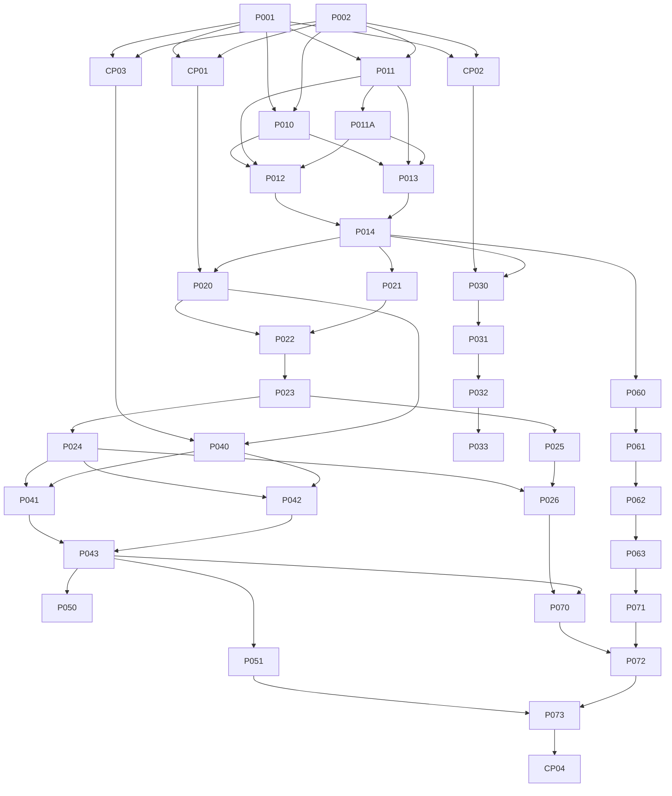

# Backlog executável

## Convenções

Status: `TODO`, `BLOCKED`, `READY`, `IN_PROGRESS`, `REVIEW`, `DONE`, `CANCELLED`. Implementações terminadas pelo Codex ficam em `REVIEW`; somente aprovação humana as move para `DONE`.

| ID | Título | Status | Fase | Prioridade | Complexidade | Tipo | Wave | Dependências | Paralelo com | Decisão humana | Prompt |
|---|---|---|---|---|---|---|---|---|---|---|---|
| P001 | Auditar checkout atual | REVIEW | 0 | P0 | S | BLOQUEADOR | 0 | — | P002 | Não | [P001](prompts/P001-auditar-checkout.md) |
| P002 | Estruturar documentação e ADRs definidos | REVIEW | 1 | P0 | M | SEQUENCIAL | 0 | — | P001 | Não | [P002](prompts/P002-documentar-arquitetura.md) |
| CP01 | Aprovar modelo mínimo de dados | BLOCKED | 1 | P0 | XS | CHECKPOINT | C1 | P001, P002 | CP02, CP03 | **Sim** | [CP01](prompts/CP01-aprovar-modelo-dados.md) |
| CP02 | Aprovar arquitetura inicial de Skills | BLOCKED | 1 | P0 | XS | CHECKPOINT | C1 | P001, P002 | CP01, CP03 | **Sim** | [CP02](prompts/CP02-aprovar-skills.md) |
| CP03 | Aprovar contrato inicial MCP | BLOCKED | 1 | P0 | XS | CHECKPOINT | C1 | P001, P002 | CP01, CP02 | **Sim** | [CP03](prompts/CP03-aprovar-mcp.md) |
| P010 | Caracterizar build e ampliar testes de regressão Angular | TODO | 2 | P0 | S | PARALELIZÁVEL | 1 | P001, P002 | P011 | Não | [P010](prompts/P010-testes-regressao-angular.md) |
| P011 | Auditar `pedagogia.ia-api` e fechar inventário OpenAI | BLOCKED | 2 | P0 | M | PARALELIZÁVEL | 1 | P001, P002 | P010 | **Disponibilizar checkout/acesso** | [P011](prompts/P011-inventario-backend-externo.md) |
| P011A | Definir consolidação incremental dos repositórios | BLOCKED | 2 | P0 | S | CHECKPOINT | C1.5 | P011 | — | **Sim: estratégia de migração/deploy** | A refinar após P011 |
| P012 | Remover rota/UI de geração e feedback | TODO | 2 | P0 | M | SEQUENCIAL | 2 | P010, P011, P011A | — | Não | [P012](prompts/P012-remover-gerador-frontend.md) |
| P013 | Remover autenticação e Supabase do Angular | TODO | 2 | P0 | M | SEQUENCIAL | 2 | P010, P011, P011A | — | Não | [P013](prompts/P013-remover-auth-frontend.md) |
| P014 | Auditar resíduos OpenAI/auth no monorepo | TODO | 2 | P0 | S | BLOQUEADOR | 3 | P012, P013 | — | Não | A refinar |
| P020 | Definir contrato de domínio aprovado | BLOCKED | 3 | P0 | S | BLOQUEADOR | 4 | CP01, P014 | P030 | CP01 | A refinar após CP01 |
| P021 | Criar esqueleto FastAPI e health check | TODO | 3 | P0 | M | SEQUENCIAL | 4 | P014 | P030 | Não | A refinar |
| P022 | Criar models/schemas de atividade | BLOCKED | 3 | P0 | M | SEQUENCIAL | 5 | P020, P021 | — | CP01 | A refinar |
| P023 | Configurar migration inicial PostgreSQL | BLOCKED | 4 | P0 | M | SEQUENCIAL | 6 | P022 | — | Revisar migration | A refinar |
| P024 | Criar repository read-only e filtros SQL | TODO | 4 | P0 | M | SEQUENCIAL | 7 | P023 | — | Não | A refinar |
| P025 | Criar seed público representativo | TODO | 4 | P0 | M | PARALELIZÁVEL | 7 | P023 | P024 | Revisão pedagógica | A refinar |
| P026 | Expor API pública read-only | TODO | 4 | P0 | M | SEQUENCIAL | 8 | P024, P025 | — | Não | A refinar |
| P030 | Definir casos de teste das Skills aprovadas | BLOCKED | 5 | P0 | S | PARALELIZÁVEL | 4 | CP02, P014 | P020, P021 | CP02 | A refinar após CP02 |
| P031 | Implementar Skill central | BLOCKED | 5 | P0 | M | SEQUENCIAL | 5 | P030 | — | CP02 | A refinar |
| P032 | Implementar Skills especializadas aprovadas | BLOCKED | 5 | P0 | M | PARALELIZÁVEL | 6 | P031 | P023 | CP02 | A refinar |
| P033 | Executar suíte reprodutível de Skills | TODO | 5 | P0 | S | SEQUENCIAL | 7 | P032 | P024, P025 | Revisão pedagógica | A refinar |
| P040 | Especificar schemas MCP aprovados | BLOCKED | 6 | P0 | S | BLOQUEADOR | 5 | CP03, P020 | P022, P031 | CP03 | A refinar após CP03 |
| P041 | Implementar `search_activities` read-only | TODO | 6 | P0 | M | SEQUENCIAL | 8 | P024, P040 | — | Não | A refinar |
| P042 | Implementar `get_activity` read-only | TODO | 6 | P0 | S | PARALELIZÁVEL | 8 | P024, P040 | P041 (com arquivos separados) | Não | A refinar |
| P043 | Testar schemas, erros, limites e garantia read-only | TODO | 6 | P0 | M | SEQUENCIAL | 9 | P041, P042 | — | Não | A refinar |
| P050 | Documentar instalação ChatGPT/MCP | TODO | 7 | P0 | S | PARALELIZÁVEL | 10 | P043 | P051 | Não | A refinar |
| P051 | Smoke test ChatGPT → MCP | TODO | 7 | P0 | M | PARALELIZÁVEL | 10 | P043 | P050 | Pode exigir ambiente ChatGPT | A refinar |
| P060 | Redesenhar rotas/conteúdo do site vitrine | TODO | 8 | P0 | M | BLOQUEADOR | 4 | P014 | P020, P021, P030 | Revisão de conteúdo | A refinar |
| P061 | Implementar landing e proposta | TODO | 8 | P0 | M | PARALELIZÁVEL | 5 | P060 | P022, P031, P040 | Não | A refinar |
| P062 | Implementar tutorial, instalação, exemplos e FAQ | TODO | 8 | P0 | M | SEQUENCIAL | 6 | P061 | P023, P032 | Não | A refinar |
| P063 | Testes Angular, acessibilidade e responsividade | TODO | 8 | P0 | M | SEQUENCIAL | 7 | P062 | P024, P025, P033 | Não | A refinar |
| P070 | Configurar deploy FastAPI + Neon | TODO | 9 | P0 | L | SEQUENCIAL | 10 | P026, P043 | P050 | Mudança de infraestrutura | A refinar |
| P071 | Configurar deploy Angular e SPA fallback | TODO | 9 | P0 | S | PARALELIZÁVEL | 10 | P063 | P050, P070 | Não | A refinar |
| P072 | Hardening de CORS, logs, erros, secrets e privacidade | TODO | 9 | P0 | M | SEQUENCIAL | 11 | P070, P071 | — | Não | A refinar |
| P073 | Testes E2E/smoke e documentação operacional | TODO | 9 | P0 | M | SEQUENCIAL | 12 | P051, P072 | — | Não | A refinar |
| CP04 | Revisão humana e validação do MVP | BLOCKED | 9 | P0 | M | CHECKPOINT | C2 | P073 | — | **Sim** | A refinar |
| F100 | Autenticação, OAuth, contas e perfil | TODO | 10 | P1 | L | CHECKPOINT | Futuro | CP04 | — | **Sim** | Macro |
| F101 | Turmas e escolas | TODO | 10 | P2 | L | CHECKPOINT | Futuro | F100 | — | **Sim** | Macro |
| F102 | Favoritos e coleções | TODO | 10 | P2 | M | CHECKPOINT | Futuro | F100 | — | **Sim** | Macro |
| F103 | Avaliações e comentários | TODO | 12 | P3 | L | CHECKPOINT | Futuro | F100 | — | **Sim** | Macro |
| F104 | Publicação e moderação | TODO | 12 | P3 | L | CHECKPOINT | Futuro | F100, F103 | — | **Sim** | Macro |
| F105 | MCP de escrita | TODO | 11 | P2 | L | CHECKPOINT | Futuro | F100, F104 | — | **Sim** | Macro |
| F106 | Comunidade | TODO | 12 | P3 | L | CHECKPOINT | Futuro | F104 | — | **Sim** | Macro |
| F107 | BNCC estruturada | TODO | 12 | P2 | L | CHECKPOINT | Futuro | CP04 | — | **Sim** | Macro |
| F108 | Busca semântica/embeddings | TODO | 12 | P3 | L | CHECKPOINT | Futuro | CP04 | — | **Sim; custo variável** | Macro |
| F109 | Personalização | TODO | 12 | P3 | L | CHECKPOINT | Futuro | F100 | — | **Sim** | Macro |
| F110 | Monetização | TODO | 12 | P3 | L | CHECKPOINT | Futuro | F100 | — | **Sim** | Macro |

## Regras de liberação imediata

P001 e P002 estão em `REVIEW`, não `DONE`. Após aprovação humana, movê-las para `DONE`; então CP01–CP03 e P010–P011 passam a `READY`. Checkpoints somente passam a `DONE` após uma escolha explícita registrada em ADR. Itens com checkpoint pendente continuam `BLOCKED` mesmo que outras dependências tenham terminado.

## DAG

O grafo foi construído sem arestas de itens futuros para o MVP e não contém dependência circular.

## Waves e conflitos

### Wave 0 — entregue para revisão

`P001 || P002`

Ambas alteram documentação central; foram integradas na mesma branch para evitar merge concorrente. Risco baixo após revisão cruzada de evidências.

### Checkpoint C1

`CP01 || CP02 || CP03`

São decisões independentes, mas CP01 influencia o schema de saída detalhada do MCP. Registrar primeiro CP01, depois CP03, se as respostas forem dadas juntas.

### Wave 1 — preparação segura

`P010 || P011` — P011 permanece bloqueada até o checkout de `pedagogia.ia-api` estar acessível.

- **Compartilhado:** backlog e inventário documental.
- **Risco:** baixo no código; médio em documentação.
- **Estratégia:** branches `codex/P010-angular-regression` e `codex/P011-api-audit`; P010 faz testes locais, P011 audita o segundo repositório sem modificá-lo. Após P011, o checkpoint P011A escolhe como preservar histórico e deploy na consolidação. Merge P010 antes das mudanças de monorepo e reconciliar BACKLOG uma vez.

### Wave 2 — remoção incremental

`P012 → P013` (sequencial por padrão)

Ambas alteram rotas, shell e headers; paralelizar causaria conflito alto. Branches opcionais `codex/P012-remove-generator` e `codex/P013-remove-auth`; merge e estabilizar P012 antes de iniciar P013.

### Waves 4–8 — após contratos

`P020 || P021 || P030 || P060` pode ocorrer em áreas separadas depois dos checkpoints e P014. Depois: `P022 || P031 || P040 || P061`, observando que P040 depende de P020. Migrations/repository permanecem sequenciais (`P022 → P023 → P024 → P026`). Skills e site podem avançar em paralelo. MCP só começa após repository e contrato.

## Comando de retomada

Leia os seis documentos de `docs/project/`, todos os ADRs e o código atual. Confirme P001/P002 com revisão humana, identifique a primeira Wave cujas dependências estão `DONE`, refine seus prompts, atualize status para `IN_PROGRESS` apenas ao iniciar e nunca marque implementação como `DONE` automaticamente.
