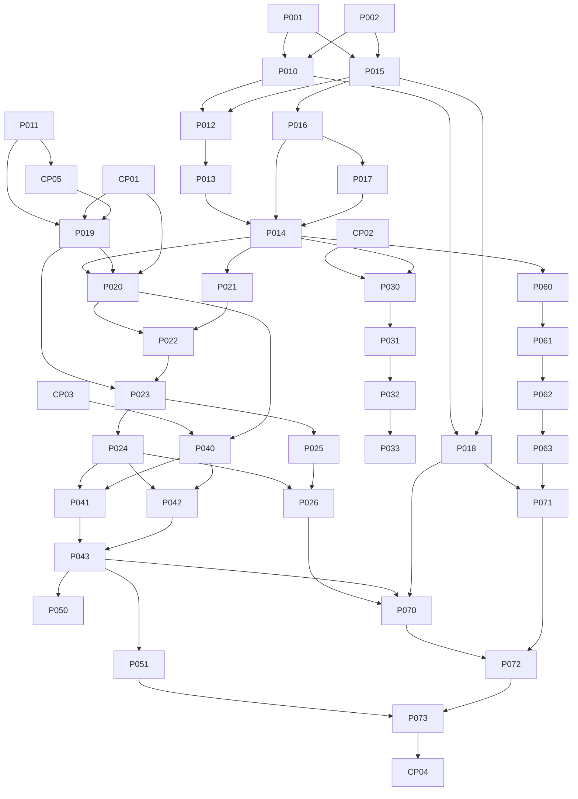

# Backlog executável reconciliado

## Convenções

Status: `TODO`, `BLOCKED`, `READY`, `IN_PROGRESS`, `REVIEW`, `DONE`, `CANCELLED`. Implementação concluída fica em `REVIEW`; somente aprovação humana move para `DONE`. Esta reconciliação não iniciou nenhuma Wave.

| ID | Título | Status | Fase | Prioridade | Complexidade | Tipo | Wave | Dependências | Paralelo com | Decisão humana | Prompt |
|---|---|---|---|---|---|---|---|---|---|---|---|
| P001 | Auditar checkout frontend original | REVIEW | 0 | P0 | S | BLOQUEADOR | 0 | — | P002 | Revisar | [P001](prompts/P001-auditar-checkout.md) |
| P002 | Estruturar documentação e ADRs definidos | REVIEW | 1 | P0 | M | SEQUENCIAL | 0 | — | P001 | Revisar | [P002](prompts/P002-documentar-arquitetura.md) |
| CP01 | Aprovar modelo mínimo de dados à luz do schema legado | BLOCKED | 1 | P0 | XS | CHECKPOINT | C1 | P001, P002 | CP02, CP03 | **Sim** | [CP01](prompts/CP01-aprovar-modelo-dados.md) |
| CP02 | Aprovar arquitetura inicial de Skills | BLOCKED | 1 | P0 | XS | CHECKPOINT | C1 | P001, P002 | CP01, CP03 | **Sim** | [CP02](prompts/CP02-aprovar-skills.md) |
| CP03 | Aprovar contrato/transporte MCP | BLOCKED | 1 | P0 | XS | CHECKPOINT | C1 | P001, P002 | CP01, CP02 | **Sim** | [CP03](prompts/CP03-aprovar-mcp.md) |
| P010 | Caracterizar build e testes Angular | TODO | 2 | P0 | S | PARALELIZÁVEL | 1 | P001, P002 | P015 | Não | [P010](prompts/P010-testes-regressao-angular.md) |
| P011 | Auditar backend incorporado e inventário OpenAI | REVIEW | 2 | P0 | M | BLOQUEADOR | R | — | — | Revisar reconciliação | [P011](prompts/P011-inventario-backend-externo.md) |
| P011A | Definir estratégia de consolidação dos repositórios | CANCELLED | 2 | P0 | S | CHECKPOINT | — | P011 | — | Não | Consolidação já realizada; sem objeto |
| P012 | Remover rota/UI Angular de geração e feedback | TODO | 2 | P0 | M | PARALELIZÁVEL | 2 | P010, P015 | P016 | Não | [P012](prompts/P012-remover-gerador-frontend.md) |
| P013 | Remover autenticação e Supabase do Angular | TODO | 2 | P0 | M | PARALELIZÁVEL | 3 | P012 | P017 | Não | [P013](prompts/P013-remover-auth-frontend.md) |
| P014 | Auditar resíduos OpenAI/auth no monorepo | TODO | 2 | P0 | S | BLOQUEADOR | 4 | P012, P013, P016, P017 | P018 | Não | A refinar após Wave 3 |
| P015 | Criar baseline/testes de caracterização FastAPI | TODO | 2 | P0 | M | PARALELIZÁVEL | 1 | P001, P002 | P010 | Não | [P015](prompts/P015-testes-regressao-fastapi.md) |
| P016 | Remover geração, feedback e controle de IP do backend | TODO | 2 | P0 | M | PARALELIZÁVEL | 2 | P015 | P012 | Não | [P016](prompts/P016-remover-geracao-backend.md) |
| P017 | Remover auth, perfis e CRUD privado do backend | TODO | 2 | P0 | M | PARALELIZÁVEL | 3 | P016 | P013 | CP05 se houver dados | [P017](prompts/P017-remover-auth-backend.md) |
| P018 | Validar CI e contratos de deploy do monorepo | TODO | 2 | P0 | M | PARALELIZÁVEL | 4 | P010, P015 | P014 | Acesso ao Vercel para etapa remota | Detalhamento intermediário |
| P019 | Planejar transição dos dados/schema Supabase legado | BLOCKED | 3 | P0 | M | BLOQUEADOR | C1.5 | P011, CP01, CP05 | — | CP01 e CP05 | A refinar após checkpoints |
| CP05 | Decidir retenção/exportação/descarte de dados legados | BLOCKED | 3 | P0 | XS | CHECKPOINT | C1.5 | P011 | — | **Sim; confirmar produção/dados** | [CP05](prompts/CP05-dados-legados.md) |
| P020 | Definir contrato de domínio aprovado | BLOCKED | 3 | P0 | S | BLOQUEADOR | 5 | CP01, P014, P019 | P030, P060 | CP01 | A refinar após CP01 |
| P021 | Modularizar FastAPI existente e adicionar health | TODO | 3 | P0 | M | PARALELIZÁVEL | 5 | P014 | P020, P030, P060 | Não | A refinar após Wave 4 |
| P022 | Criar models/schemas de atividade | BLOCKED | 3 | P0 | M | SEQUENCIAL | 6 | P020, P021 | P031, P040, P061 | CP01 | A refinar |
| P023 | Criar migration inicial PostgreSQL | BLOCKED | 4 | P0 | M | SEQUENCIAL | 7 | P019, P022 | P032, P062 | Revisar migration | A refinar |
| P024 | Criar repository read-only e filtros SQL | TODO | 4 | P0 | M | SEQUENCIAL | 8 | P023 | P025, P033, P063 | Não | A refinar |
| P025 | Criar seed público representativo | TODO | 4 | P0 | M | PARALELIZÁVEL | 8 | P023 | P024 | Revisão pedagógica | A refinar |
| P026 | Expor API pública read-only | TODO | 4 | P0 | M | SEQUENCIAL | 9 | P024, P025 | — | Não | A refinar |
| P030 | Definir casos de teste das Skills | BLOCKED | 5 | P0 | S | PARALELIZÁVEL | 5 | CP02, P014 | P020, P021, P060 | CP02 | A refinar após CP02 |
| P031 | Implementar Skill central | BLOCKED | 5 | P0 | M | PARALELIZÁVEL | 6 | P030 | P022, P040, P061 | CP02 | A refinar |
| P032 | Implementar Skills especializadas | BLOCKED | 5 | P0 | M | PARALELIZÁVEL | 7 | P031 | P023, P062 | CP02 | A refinar |
| P033 | Executar suíte reprodutível de Skills | TODO | 5 | P0 | S | PARALELIZÁVEL | 8 | P032 | P024, P025, P063 | Revisão pedagógica | A refinar |
| P040 | Especificar schemas MCP aprovados | BLOCKED | 6 | P0 | S | PARALELIZÁVEL | 6 | CP03, P020 | P022, P031, P061 | CP03 | A refinar após CP03 |
| P041 | Implementar `search_activities` read-only | TODO | 6 | P0 | M | SEQUENCIAL | 9 | P024, P040 | — | Não | A refinar |
| P042 | Implementar `get_activity` read-only | TODO | 6 | P0 | S | PARALELIZÁVEL | 9 | P024, P040 | P041 só com arquivos separados | Não | A refinar |
| P043 | Testar MCP e garantia read-only | TODO | 6 | P0 | M | SEQUENCIAL | 10 | P041, P042 | — | Não | A refinar |
| P050 | Documentar instalação ChatGPT/MCP | TODO | 7 | P0 | S | PARALELIZÁVEL | 11 | P043 | P051, P070, P071 | Não | A refinar |
| P051 | Smoke test ChatGPT → MCP | TODO | 7 | P0 | M | PARALELIZÁVEL | 11 | P043 | P050 | Pode exigir ChatGPT | A refinar |
| P060 | Redesenhar rotas/conteúdo do site vitrine | TODO | 8 | P0 | M | PARALELIZÁVEL | 5 | P014 | P020, P021, P030 | Revisão de conteúdo | A refinar |
| P061 | Implementar landing e proposta | TODO | 8 | P0 | M | PARALELIZÁVEL | 6 | P060 | P022, P031, P040 | Não | A refinar |
| P062 | Implementar tutorial/instalação/exemplos/FAQ | TODO | 8 | P0 | M | PARALELIZÁVEL | 7 | P061 | P023, P032 | Não | A refinar |
| P063 | Testes Angular, acessibilidade e responsividade | TODO | 8 | P0 | M | PARALELIZÁVEL | 8 | P062 | P024, P025, P033 | Não | A refinar |
| P070 | Configurar deploy FastAPI + Neon | TODO | 9 | P0 | L | PARALELIZÁVEL | 11 | P026, P043, P018 | P050, P071 | Mudança de infraestrutura | A refinar |
| P071 | Configurar deploy Angular e SPA fallback | TODO | 9 | P0 | S | PARALELIZÁVEL | 11 | P063, P018 | P050, P070 | Não | A refinar |
| P072 | Hardening CORS/logs/erros/secrets/privacidade | TODO | 9 | P0 | M | SEQUENCIAL | 12 | P070, P071 | — | Não | A refinar |
| P073 | E2E/smoke e documentação operacional | TODO | 9 | P0 | M | SEQUENCIAL | 13 | P051, P072 | — | Não | A refinar |
| CP04 | Revisão humana e validação do MVP | BLOCKED | 9 | P0 | M | CHECKPOINT | C2 | P073 | — | **Sim** | A refinar |
| F100 | Autenticação, OAuth, contas e perfil | TODO | 10 | P1 | L | CHECKPOINT | Futuro | CP04 | — | **Sim** | Macro |
| F101 | Turmas e escolas | TODO | 10 | P2 | L | CHECKPOINT | Futuro | F100 | — | **Sim** | Macro |
| F102 | Favoritos e coleções | TODO | 10 | P2 | M | CHECKPOINT | Futuro | F100 | — | **Sim** | Macro |
| F103 | Avaliações e comentários | TODO | 12 | P3 | L | CHECKPOINT | Futuro | F100 | — | **Sim** | Macro |
| F104 | Publicação e moderação | TODO | 12 | P3 | L | CHECKPOINT | Futuro | F100, F103 | — | **Sim** | Macro |
| F105 | MCP de escrita | TODO | 11 | P2 | L | CHECKPOINT | Futuro | F100, F104 | — | **Sim** | Macro |
| F106 | Comunidade | TODO | 12 | P3 | L | CHECKPOINT | Futuro | F104 | — | **Sim** | Macro |
| F107 | BNCC estruturada | TODO | 12 | P2 | L | CHECKPOINT | Futuro | CP04 | — | **Sim** | Macro |
| F108 | Busca semântica/embeddings | TODO | 12 | P3 | L | CHECKPOINT | Futuro | CP04 | — | **Sim; custo** | Macro |
| F109 | Personalização | TODO | 12 | P3 | L | CHECKPOINT | Futuro | F100 | — | **Sim** | Macro |
| F110 | Monetização | TODO | 12 | P3 | L | CHECKPOINT | Futuro | F100 | — | **Sim** | Macro |

## Alterações desta reconciliação

- **Adicionados:** P015–P019 e CP05, cobrindo baseline FastAPI, duas remoções backend, CI/deploy do monorepo e dados legados.
- **Alterados:** P011 → REVIEW; P012/P013 removem dependência de consolidação; P021 passa de “criar” para adaptar/modularizar FastAPI; P023 depende do plano de transição; DAG/Waves incorporam backend.
- **Cancelado:** P011A, pois a consolidação já está no Git.
- **Bloqueados:** CP01–CP03/CP05 e seus dependentes; P019 aguarda decisões de modelo e dados.
- **Liberados:** nenhum automaticamente. P010/P015 continuam TODO até P001/P002 serem aprovados como DONE.

## DAG atualizado

O DAG não possui ciclos. Checkpoints CP01–CP03 também dependem da aprovação de P001/P002 conforme tabela; arestas foram omitidas do desenho para legibilidade.

## Waves afetadas e risco de merge

### Wave 1 — baseline dos dois apps

`P010 || P015`

Código separado (`frontend/` versus `backend/`), risco baixo; ambos podem tocar backlog, portanto manter docs em um integrador ou fazer merge P010 → P015 e reconciliar uma vez. Branches: `codex/P010-angular-baseline`, `codex/P015-fastapi-baseline`.

### Wave 2 — retirar geração paga

`P012 || P016`

Passaram a ser paralelas depois dos baselines: contrato `/gerar` desaparecerá nos dois lados e não será substituído. Risco de código baixo; alinhar critério de resíduos e merge backend P016 antes do frontend P012 para evitar UI apontando temporariamente a endpoint inexistente apenas em produção (deploys devem continuar coordenados).

### Wave 3 — retirar contas e escrita privada

`P013 || P017`

Passaram a ser paralelas em diretórios diferentes, mas P017 só pode remover/desativar schema após CP05; a remoção de endpoints pode avançar sem DROP. Merge backend e frontend como uma unidade de release. P017 sucede P016 porque ambos alteram `backend/api/main.py`; P013 sucede P012 por rotas/shell comuns.

### Wave 4 — verificação

`P014 || P018`

Buscas de resíduos e CI/deploy são separáveis. P018 pode preparar checks locais, mas validação remota requer acesso humano ao Vercel. Alto risco em arquivos futuros de workflow se paralelizado com outra tarefa de CI; proprietário único para `.github/`.

### Waves 5–9 — domínio e experiência

`P020 || P021 || P030 || P060` após seus bloqueadores; depois `P022 || P031 || P040 || P061`. Banco continua `P022 → P023 → P024 → P026`; Skills e site avançam em paralelo. MCP aguarda contrato e repository. P019 agora antecede qualquer migration.

## Estado atual

- **READY:** nenhuma (P001/P002 aguardam revisão humana).
- **BLOCKED:** CP01, CP02, CP03, CP05, P019, P020, P022, P023, P030, P031, P032, P040 e CP04.
- **REVIEW:** P001, P002 e P011.
- **Próxima Wave recomendada:** após aprovar P001/P002/P011, Wave 1: `P010 || P015`.
- **Não executar nesta reconciliação:** mesmo após aprovação, iniciar a Wave exige uma sessão posterior e atualização explícita para IN_PROGRESS.
